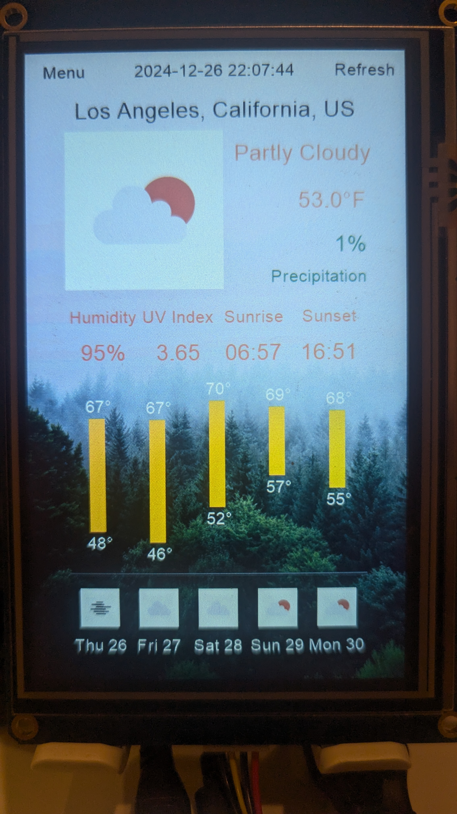
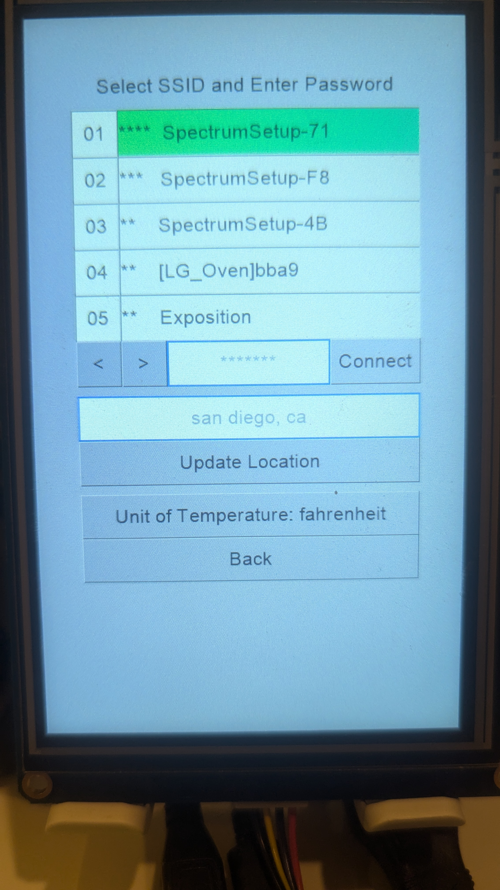

# Pi Zero Weather

A weather panel project using Raspberry Pi Zero and Nextion touch screen.

<div style="display: flex; align-items: center;">
    
    
</div>

Features:
- Weather data fetching from Open-Meteo API
- Utilizes GI (PyGObject) for network connection management
- Utilizes Nextion GUI designing commands to draw 5-day weather bar chart
- Automatic location detection via IPInfo.io API
- Geocoder for location name resolution via Nominatim API

Demo:

[https://www.youtube.com/watch?v=vR5DYhlheCI](https://www.youtube.com/watch?v=vR5DYhlheCI)

Hardware:
- Raspberry Pi Zero WH
- Nextion NX8048T050 display
- USB to TTL adapter (IZOKEE CP2102 in this project)
- SD card, power supply, HDMI adapter for Pi, etc.

## Setup Steps

### Setup Nextion Display
1. Install Nextion Editor and open `./display/NX8048T050/project.HMI` in the editor. You can use "Debug" button to simulate the display and check if any error occurs.
2. Install the driver for the USB to TTL adapter. Connect the display to your computer using a USB to TTL adapter. Note TX of the display should be connected to RX of the adapter and vice versa.
3. Push the "Upload" button in the Nextion Editor to upload the project to the display. If the display is not detected, check the connection and the driver installation.
4. Connect the display to the Raspberry Pi Zero W. TX of the display shoud be connexted to uart0 RX (GPIO16) of the Pi Zero W and vice versa.
5. 
### Setup Raspberry Pi Zero W
1. Install **Raspberry Pi OS Lite** on SD card using Raspberry Pi Imager. Set up OS customization settings like ssh, wifi as needed.
2. Open bootfs directory of SD card. Write these configs in [all] section of `/boot/config.txt` to enable uart pins and allow HDMI output:
    ```toml
    [all]
    enable_uart=1
    hdmi_force_hotplug=1
    hdmi_drive=2
    ```
3. Insert SD card into Pi Zero W and boot up. Connect to Pi through SSH or HDMI monitor. Enable UART/serial interface in Raspberry Pi OS using `raspi-config`:
    ```bash
    $ sudo raspi-config
    ```
    - Select `Interfacing Options`
    - Select `Serial Port`
    - Select `No` to disable login shell over serial
    - Select `Yes` to enable serial hardware
    - Reboot

    The final configuration should look like:
    ```
    The serial login shell is disabled
    The serial interface is enabled
    ```

### Setup Python Dependencies
1. Login to Pi Zero and install NetworkManager development package:
    ```bash
    $ sudo apt install libgirepository1.0-dev gir1.2-nm-1.0 python3-gi python3-gi-cairo
    ```
    $ mkdir -p /etc/NetworkManager/conf.d
    ```
    To allow user program to control NetworkManager without root privileges. Create `any-user.conf` within conf.d:
    ```toml
    [main]
    auth-polkit=false
    ```
    Restart NetworkManager:
    ```bash
    systemctl restart NetworkManager
    ```
2. Copy the `./pi-zero` directory of this repo to your home directory of Pi Zero from your personal computer:
    ```bash
    $ scp -r pi-zero piuser@192.168.x.x:~/
    ```
3. Create venv and install dependencies (Python 3.11.2):
    ```bash
    $ cd pi-zero
    $ python -m venv ./venv
    $ source ./venv/bin/activate
    $ pip install -r requirements.txt
    ```
4. Run the program:
    ```bash
    $ python main.py
    ```


Copy the directory `pi-zero` to the your home directory of Pi Zero. Login to your Pi through SSH or HDMI monitor, and run the following commands:

```bash
sudo apt install libgirepository1.0-dev gir1.2-nm-1.0
mkdir -p /etc/NetworkManager/conf.d
# create any-user.conf within conf.d and include within:
[main]
auth-polkit=false
# restart NM
systemctl restart NetworkManager

cd pi-zero
python -m venv ./weather-venv
source ./weather-venv/bin/activate
pip install -r requirements.txt
```

## Image sources

- background: Goč, Serbia by Filip Zrnzević on Unsplash
- weather icons: https://openweathermap.org/weather-conditions